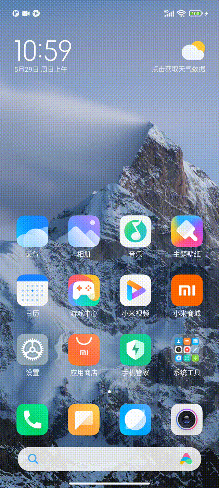

# Appium_demo
#### 介绍
安卓移动端自动化测试，使用testNG框架，测试对象为网易邮箱大师。
测试流程：  
1、添加邮箱账户。  
2、第一次发送邮件。  
3、在收件箱列表中，通过长按选中邮件，并删除。  
4、第二次发送新邮件。  
5、在收件箱中，通过已发送的邮件标题，查找到邮件，并打开邮件详情。   
6、查看邮件内容的详情页面，点击删除按钮，删除邮件   
动作功能覆盖：点击、输入、滑动、下拉刷新、长按、截图、生成测试报告。

#### 软件架构
基于Appium + Java + testNG

#### 安装教程   
1.  本地安装jdk，并配置环境变量   
2.  本地安装appium server，或者appium desktop（如果是desktop版，则需手动启动）   
3.  本地安装node.js环境    
4.  安装SDK manager，通过此工具下载所依赖的工具包   

#### 使用说明
1、使用真机USB连接（推荐）： 

    1、打开手机开发者模式，启用USB调试
    2、通过adb devices查看设备ID，并把ID设置capabilities
2、使用模拟器，测试服务端需要安装模拟器   
测试运行

